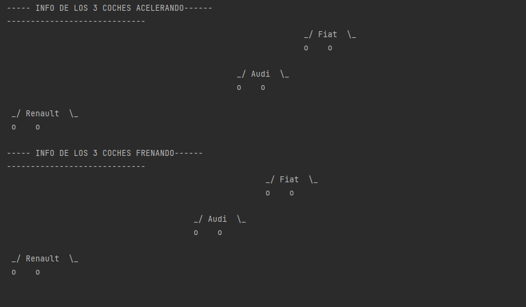

> #### ¿Qué hace el meotodo Main?

El método Main es el punto de entrada de un programa ejecutable; es donde se inicia y finaliza el control del programa.

> #### Breakpoint linea 27.
> #### ¿Averigua valores de variables velocidad_nueva1, velocidad_nueva2 y velocidad_nueva3.  
> #### Averigua también qué datos tienen en sus parámetros los coches con variables c, c2 y  c3.

Las primeras velocidades, indican la velocidad que llegan a alcanzar antes de terminar de acelerar, para ver esto estan los c, c2, c3 para poder visualizar su posicion mientras estan acelerando.

> #### Breakpoint linea 46.
> #### ¿Averigua valores de variables velocidad_nueva1, velocidad_nueva2 y velocidad_nueva3.  
> #### Averigua también qué datos tienen en sus parámetros los coches con variables c, c2 y  c3.

Las velocidades siguientes muestran la velocidad a la que van una vez han terminado de frenar, para ver esto estan otra vez las variables c, c2, c3 donde se puede oberservar como todos los coches se han quedado mas atras de donde estaban anteriormente.

